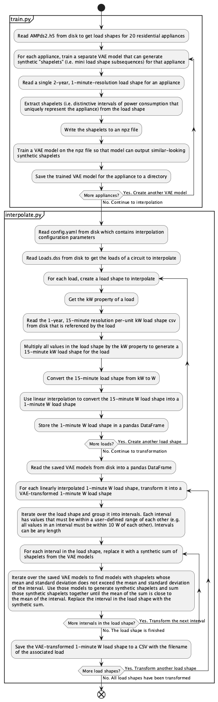

# MAGIC interpolation repository
- The MAGIC interpolation repository is a tool that is designed to interpolate 15-minute load shapes into 1-minute load shapes. The first step is to
  select a source of 1-minute residential appliance load shapes. We use the AMPds2 dataset for this purpose. It contains 2-year, 1-minute load shapes
  for 20 individual appliances from a home in Vancouver. The second step is to select a source of 15-minute load shapes to interpolate. We use the
  SMART-DS dataset which contains 1-year, 15-minute load shapes for residential customer and commercial customer loads. The third step is to train a
  separate variational autoencoder (VAE) model for each individual 1-minute appliance load shape in order to create models that can generate synthetic
  data to represent those appliances. The fourth step is to interpolate each 15-minute load shape. For a given 15-minute load shape, interpolation is
  done in several steps. First, divide the 15-minute load shape into intervals. Next, consider the mean, standard deviation, and length of a given
  interval. Select a set of trained VAE models and sample those models to generate a set of synthetic 1-minute load shapes. Sum the synthetic 1-minute
  load shapes together until the mean, standard deviation, and length of the sum matches the mean, standard deviation, and length of the interval.
  Replace the 15-minute interval with the sum of the 1-minute samples. Do this for all 15-minute intervals in a load shape until the entire 15-minute
  load shape has been transformed into an equivalent load shape with 1-minute resolution. This repository contains a set of scripts and data for
  performing this interpolation.
## Diagrams
- The following diagram shows the basic workflow for how the software interpolates 15-minute load shapes into 1-minute load shapes.
- 
## Repository Structure
- The MAGIC interpolation repository uses the TimeVAE repository as the implementation for the variational autoencoder.
  - See `lib/timeVAE/README.md` for documentation on TimeVAE
- The project has the following directories and files:
```plaintext
magic/
├── lib/                                                # Third-party tools
│   └── timeVAE/                                        # TimeVAE tool
├── src/                                                # Source code
│   └── interpolation/                                  # Interpolation code
│       ├── data/                                       # External datasets
│       │   ├── ampds2/                                 # AMPds2 dataset
│       │   │   └── AMPds2.h5                           # AMPds2 hierarchical data format file containing all AMPds2 appliances
│       │   └── smartds/2018/GSO/rural/                 # SMART-DS 2018 Greensboro dataset
│       │       ├── profiles/                           # Consumer and solar load profiles
│       │       │   ├── com_kvar_12814_pu.csv           # Commercial load profile named "<customer class>_<load type>_<profile id>_pu.csv" representing the fraction of the maximum reactive load in the year (1.0 being the maximum)
│       │       │   ├── ...                             # Additional commercial load profiles
│       │       │   ├── com_kw_12814_pus.csv            # Commercial load profile named "<customer class>_<load type>_<profile id>_pu.csv" representing the fraction of the maximum real load in the year (1.0 being the maximum)
│       │       │   ├── ...                             # Additional commercial load profiles
│       │       │   ├── GSO_36.1383_-79.7183_15_90.csv  # Solar irradiance profile named "<dataset>_<latitude>_<longitude>_<tilt>_<azimuth>_full.csv" representing the plane-of-array irradiance of the panels in kW/m2 
│       │       │   ├── ...                             # Additional solar load profiles
│       │       │   ├── res_kvar_2_pu.csv               # Residential load profile named "<customer class>_<load type>_<profile id>_pu.csv" representing the fraction of the maximum reactive load in the year (1.0 being the maximum)
│       │       │   ├── ...                             # Additional consumer load profiles
│       │       │   ├── res_kw_2_pu.csv                 # Residential load profile named "<customer class>_<load type>_<profile id>_pu.csv" representing the fraction of the maximum real load in the year (1.0 being the maximum)
│       │       │   └── ...                             # Additional consumer load profiles
│       │       └── scenarios/base_timeseries/opendss/  # OpenDSS files
│       │           ├── rhs0_1247/                      # Substation name
│       │           │   └── rhs0_1247--rdt1527/         # Feeder name
│       │           │       └── Loads.dss               # OpenDSS loads for feeder
│       │           └── rhs2_1247                       # Substation name
│       │               ├── rhs2_1247--rdt1262/         # Feeder name
│       │               │   └── Loads.dss               # OpenDSS loads for feeder
│       │               └── rhs2_1247--rdt1264/         # Feeder name
│       │                   └── Loads.dss               # OpenDSS loads for feeder
│       ├── doc/                                        # Documentation
│       │   └── basic-workflow.png                      # Basic workflow diagram
│       ├── outputs/                                    # Interpolated files created by interpolate.py
│       └── src/                                        # Source code
│           ├── config/                                 # Configuration files
│           │   ├── appliances.yaml                     # Appliance settings used when training models with train.py
│           │   └── config.yaml                         # Interpolation settings used when interpolating data with interpolate.py
│           ├── circuit_stats.py                        # Script to output various properties of a feeder. Used during data expoloration before training or interpolation
│           ├── interpolate.py                          # Script to perform interpolation after models have been trained
│           ├── paths.py                                # Path variables for config files, data, and outputs
│           ├── train.py                                # Training script used to train TimeVAE models which are saved to lib/timeVAE/outputs/models/
│           └── visualize.py                            # Visualization script used to view training and interpolation performance
├── install.py                                          # Install script
├── README.md                                           # README file
└── requirements.txt                                    # Dependencies
```
## Input data descriptions
### AMPds2
- The AMPds2 data is composed of a single hierarchical data format file that contains 2-year, 1-minute-resolution load shapes for 20 appliances from a
  home in Vancouver
- Hierarchical file format (hdf) files are organized like a filesystem, with the author of an hdf file specifying how content is organized inside
  their particular hdf file
  - E.g. in AMPds2.h5, the top level directory is `building1`. The next directory is `elec`. The electricity from a particular meter in `building1`
    can be retrieved as a DataFrame via `df = <hdf_file>.get(f'/building1/elec/{meter}')`. Each appliance has a meter labled as `meter2` - `meter21`,
    with `meter1` being the label for the whole house meter
### SMART-DS
- The SMART-DS data is composed of three different circuits: rhs0_1247--rdt1527, rhs2_1247--rdt1262, and rhs2_1247--rdt1264
  - rhs0_1247--rdt1527 has 1075 physical residential loads and 39 physical commercial loads
    - It has 2150 OpenDSS residential loads and 62 OpenDSS commercial loads
  - rhs2_1247--rdt1262 has 339 physical residential loads and 18 physical commercial loads
    - It has 678 OpenDSS residential loads and 30 OpenDSS commercial loads
  - rhs2_1247--rdt1264 has 571 physical residential loads and 83 physical commercial loads
    - It has 1142 OpenDSS residential loads and 125 OpenDSS commercial loads
- Each circuit is divided into three scenarios: the base case, the base case plus low PV (solar) and low BESS (battery), and the base case plus medium
  PV and high BESS
  - Each scenario has the following important files: Lines.dss, LoadShapes.dss, Loads.dss, Master.dss, Regulators.dss, and Transformers.dss
    - We are primarily interested in the Loads.dss file of each scenario. It contains a number of residential and commercial loads represented by
      OpenDSS load objects. Most of the OpenDSS loads in a given Loads.dss file have a "_1" or an "_2" suffix. These two suffixes represent a single
      customer load that is connected to a center-tap transformer. The customer load is divided equally between the active and neutral lines which
      results in two equal OpenDSS loads which are half of the total customer load.
      - E.g. the rhs0_1247-rdt1527 circuit has two loads named "load_p1rlv1359_1" and "load_p1rlv1359_2". Both of these OpenDSS loads reference an
        OpenDSS loadshape object called "res_kw_278_pu". That OpenDSS loadshape object references a CSV called "res_kw_278_pu.csv". The total load for
        the customer at building 278 at 2018-01-01 00:15:00 is calculated as follows:
        - Multiply the "kW" property of "load_p1rlv1359_1" by the first line of "res_kw_278_pu.csv": `3.9060227283575606 * 0.07488170653500545 =
          0.29248964766`
        - Multiply the "kW" property of "load_p1rlv1359_2" by the first line of "res_kw_278_pu.csv": `3.9060227283575606 * 0.07488170653500545 =
          0.29248964766`
        - Sum those values together to get the total customer load in kW: `0.29248964766 + 0.29248964766 = 0.5849792953`
          - This result can be validated by viewing the file "res_278.parquet" which has that same value in the "total_site_electricity_kw" column at
            2018-01-01 00:15:00
- Each circuit has the exact same Loads.dss file for every scenario
  - The low-PV, low-BESS scenario and the medium-PV, high-BESS scenario add OpenDSS PV and Storage objects, but they retain the same loads as in the
    base case scenario
- Each circuit has a different LoadShape.dss for every scenario
  - This is because each scenario builds on top of the base_timeseries scenario by adding additional PV and BESS objects
## Installation
Create a virtual environment and install dependencies:
```bash
python -m venv venv
source venv/bin/activate  # On Windows use `venv\Scripts\activate`
python install.py
```
## Usage
### Prepare data
- Ensure that AMPds2.h5 has been downloaded and placed into the `src/interpolation/data/ampds2` directory
  - See `src/interpolation/data/ampds2/AMPds2.txt` for instructions
### Configure training
- Set training parameters for each appliance in `src/interpolation/src/config/appliances.yaml`. The pre-configured values should work well for basic
  usage and shouldn't need to be changed
  - `load_consumption`: whether the load is "constant" or "variable"
  - `load_timing`: whether the load is "intermittent", "periodic", or "continuous"
  - `name`: the name of the appliance
  - `shapelet_end_W`: during model training, any watt value less than or equal to this value marks the end of a shapelet during shapelet detection
  - `shapelet_length`: during model training, this is chosen length of all detected shapelets for the appliance
    - A longer length increases kl_loss during training and tends to slightly reduce prior sample accuracy
    - A shorter length creates less interesting and descriptive shapelets
  - `shapelet_max_W`: during model training, any shapelet with a watt value greater than this is excluded from training the VAE model
    - This is useful when an appliance has multiple states and we want the VAE model to accuractely represent one state of the appliance instead of
      mixing states together and creating an unrepresentative model that is a combined average of all of the possible appliance states
  - `shapelet_prior_max_W`: during interpolation, any synthetic generated shapelet with an average watt value greater than this will be discarded
    - Some appliance models have more variation in their output shapelets than desired, so we filter them
  - `shapelet_prior_min_W`: during interpolation, any synthetic generated shapelet with an average watt value less than this will be discarded
    - Some appliance models have more variation in their output shapelets than desired, so we filter them
  - `shapelet_sliding_window`: during model training, whether to use a sliding window to create more training data
    - Some appliance models are more accurate if they are trained on a sliding window view of the shapelets while others are less accurate
  - `shapelet_start_W`: during model training, any watt value greater than or equal to this value marks the start of a shapelet during shapelet detection
  - `timeVAE_epochs`: during model training, this is the maximum number of training epochs that timeVAE should use when training the model
    - More epochs tends to smooth the sythentic generated shapelets of the model
    - Too many epcochs can lead to over-training which results in a model that outputs synthetic generated shapelets with too little variability
  - `timeVAE_latent_dim`: during model training, this is the `latent_dim` value that yielded the best results
    - This parameter isn't used by timeVAE. It just documents what the `latent_dim` value _should_ be set to in the `hyperparameters.yaml` file of
      timeVAE 
- The default parameter values in `appliances.yaml` have been identified after testing different parameter values across many iterations of training
  and tend to perform well. However, you may want to tune these parameters for your specific dataset.
- Note that the special top-level `appliance_name` property indicates whether all appliances should be trained or if a single specific appliance
  should be trained
  - E.g. `appliance_name: null` (the default) indicates that a new model should be created for every appliance
  - E.g. `appliance_name: dryer` indicates that only a model for the dryer should be created
### Train models
```bash
python train.py
```
- Trained models are saved in `lib/timeVAE/outputs/models/<model name>`
  - The `<model name>` is created according to the values in `appliances.yaml` as follows:
    `shapelets_<name>_len-<shapelet_length>_lat-<timeVAE_latent_dim>_epo-<timeVAE_epochs>_win-<shapelet_sliding_window>`
- Generated synthetic data is saved in `lib/timeVAE/outputs/gen_data/<model name>`
- t-SNE plots are saved in `lib/timeVAE/outputs/tnse/<model name>`
- Inspect the quality of the trained models by examining the t-SNE plots and by visualizing the sythetic generated shapelets from a model
  - By default, the t-SNE plots and synthetic generated shapelets for a newly trained model will _not_ be shown after a model has been trained because
    showing these visualizations increases training duration. If the user wants to visualize the quality of the trained model, set
    `show_training_figs` in `lib/timeVAE/timeVAE/config/config.yaml` to `true`
### Configure interpolation
- Set interpolation parameters for each load in `src/interpolation/src/config/interpolation.yaml`. The pre-configured values should work well for
  basic usage and shouldn't need to be changed
  - `load_name`: whether to interpolate all loads in the feeder or to interpolate a single load in the feeder
    - E.g. `load_name: null` (the default) indicates that every load in the feeder should have an interpolated csv created for it
    - E.g. `load_name: load_p1rlv1359` indicates that only that specific load in the feeder should be interpolated. Ensure that the load name actually
      exists in the feeder specified by `feeder_path`
  - `load_category`: whether to treat OpenDSS loads as separate loads or as parts of a physical load. See the data description above
    - E.g. `load_category: physical` means that `load_p1rlv1359_1` and `load_p1rlv1359_2` should be added together to form a physical load before that
      physical load shape is interpolated
    - E.g. `load_category: opendss` means that `load_p1rlv1359_1` and `load_p1rlv1359_2` should be interpolated as completely separate loads
  - `threshold`: the maximum allowed difference in watts between the original 15-minute OpenDSS load shape and the new interpolated 1-minute OpenDSS
    load shape at any point in time
    - E.g. `threshold: 10` means that the interpolated 1-minute data will always be very close to the original 15-minute data. The interpolated data
      will be fairly smooth because the original data is also smooth
  - `is_smooth`: whether to use synthetic generated shapelets whose standard deviation exceeds the standard deviation of the load shape that is being
    interpolated
    - E.g. `is_smooth: true` means that appliances with large standard deviations (e.g. the dryer) will almost never be used to interpolate the data
      because most 15-minute OpenDSS load shapes are very smooth (i.e. have a low standard deviation) over short intervals. The result will be an
      interpolated load shape with a very low standard deviation (i.e. it will have smooth, subtle oscillations)
    - E.g. `is_smooth: false` means that any appliance can be used to interpolate a 15-minute load shape as long as the average value of the synthetic
      generated shapelet does not exceed the average value of a given interval in the load shape. The result will be an interpolated load shape with a
      much higher standard deviation (i.e. it will have jagged, severe oscillations)
  - `is_fast`: whether to prioritize speed or variability in the interpolated load shape
    - E.g. `is_fast: true` means that certain appliance models will be sampled for synthetic generated shapelets much more frequently than others. It
      is faster to interpolate an interval by sampling repeatedly from a single model than by sampling from different models. However, certain
      appliance models will be overrepresented in the interpolated load shape
    - E.g. `is_fast: false` means that the interpolation process will try to use as many different appliance models to interpolate an interval of load
      shape as possible. The interpolated load shape will contain a more balanced representation of appliance models
  - `feeder_path`: the path to the feeder that should be interpolated. It includes the substation name and feeder name. Note that the feeder must
    exist in `src/interpolation/data/smartds/2018/GSO/rural/scenarios/base_timeseries/opendss/`
  - `multiprocessing`: whether to use multiprocessing to interpolate many loads at the same time. Multiprocessing is faster than using a single
    process, but it's harder to debug
### Interpolate data
```bash
python interpolate.py
```
- Interpolated csvs for all loads are saved in `src/interpolation/outputs/<substation name>/<feeder name>/<interpolation configuration>`
  - The `<interpolation configuration` is created according to the values in `interpolation.yaml` as follows:
    `thr-<threshold>_smo-<is_smooth>_fas-<is_fast>_mode-<load category>`
- Inspect the quality of an interpolated csv by using `visualize.py` to compare an original 15-minute load shape to the interpolated 1-minute load
  shape
## Output data descriptions
- The interpolated 1-minute csv load shapes are in watts, not kilowatts.
## References
- https://www.nature.com/articles/sdata201637 - AMPds2 dataset
- https://data.openei.org/s3_viewer?bucket=oedi-data-lake&prefix=SMART-DS%2Fv1.0%2F - OpenDSS dataset
## BSD 3-Clause License

Copyright (c) 2025, NRECA Research

#### Redistribution and use in source and binary forms, with or without modification, are permitted provided that the following conditions are met:

1. Redistributions of source code must retain the above copyright notice, this
list of conditions and the following disclaimer.

2. Redistributions in binary form must reproduce the above copyright notice,
this list of conditions and the following disclaimer in the documentation
and/or other materials provided with the distribution.

3. Neither the name of the copyright holder nor the names of its
contributors may be used to endorse or promote products derived from
this software without specific prior written permission.
 

THIS SOFTWARE IS PROVIDED BY THE COPYRIGHT HOLDERS AND CONTRIBUTORS "AS IS"

AND ANY EXPRESS OR IMPLIED WARRANTIES, INCLUDING, BUT NOT LIMITED TO, THE

IMPLIED WARRANTIES OF MERCHANTABILITY AND FITNESS FOR A PARTICULAR PURPOSE ARE

DISCLAIMED. IN NO EVENT SHALL THE COPYRIGHT HOLDER OR CONTRIBUTORS BE LIABLE

FOR ANY DIRECT, INDIRECT, INCIDENTAL, SPECIAL, EXEMPLARY, OR CONSEQUENTIAL

DAMAGES (INCLUDING, BUT NOT LIMITED TO, PROCUREMENT OF SUBSTITUTE GOODS OR

SERVICES; LOSS OF USE, DATA, OR PROFITS; OR BUSINESS INTERRUPTION) HOWEVER

CAUSED AND ON ANY THEORY OF LIABILITY, WHETHER IN CONTRACT, STRICT LIABILITY,

OR TORT (INCLUDING NEGLIGENCE OR OTHERWISE) ARISING IN ANY WAY OUT OF THE USE

OF THIS SOFTWARE, EVEN IF ADVISED OF THE POSSIBILITY OF SUCH DAMAGE.