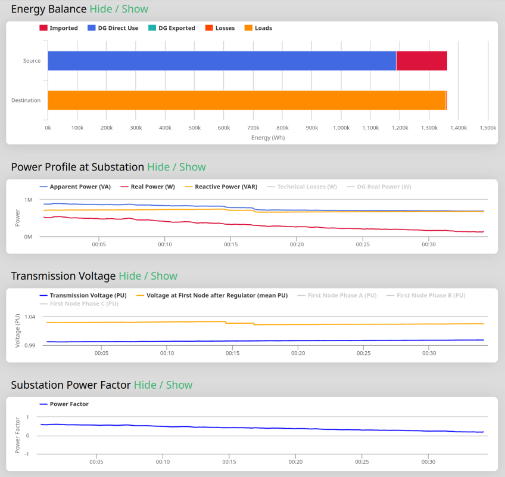
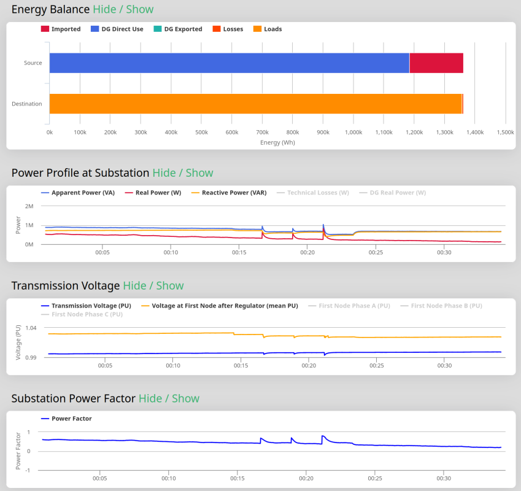
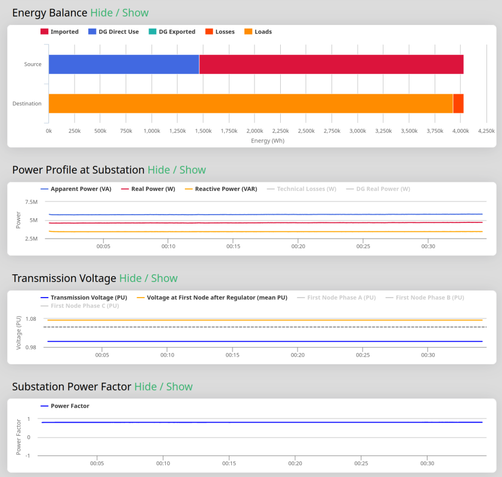
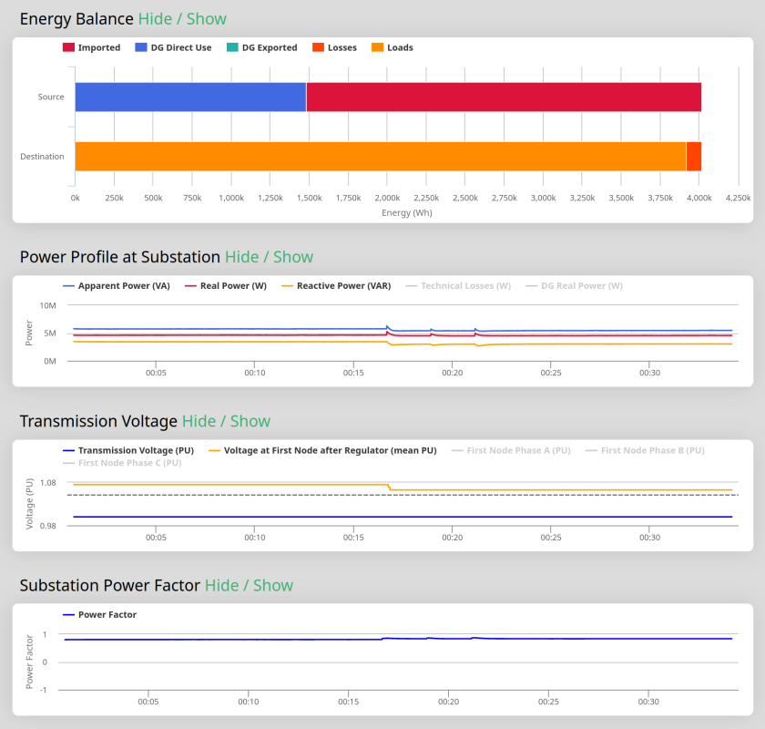
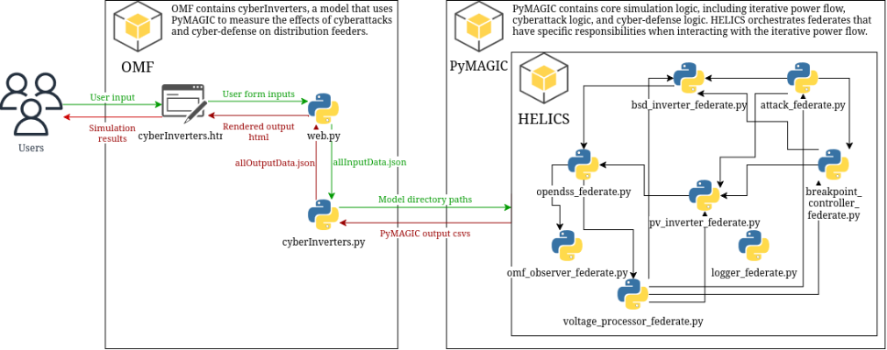
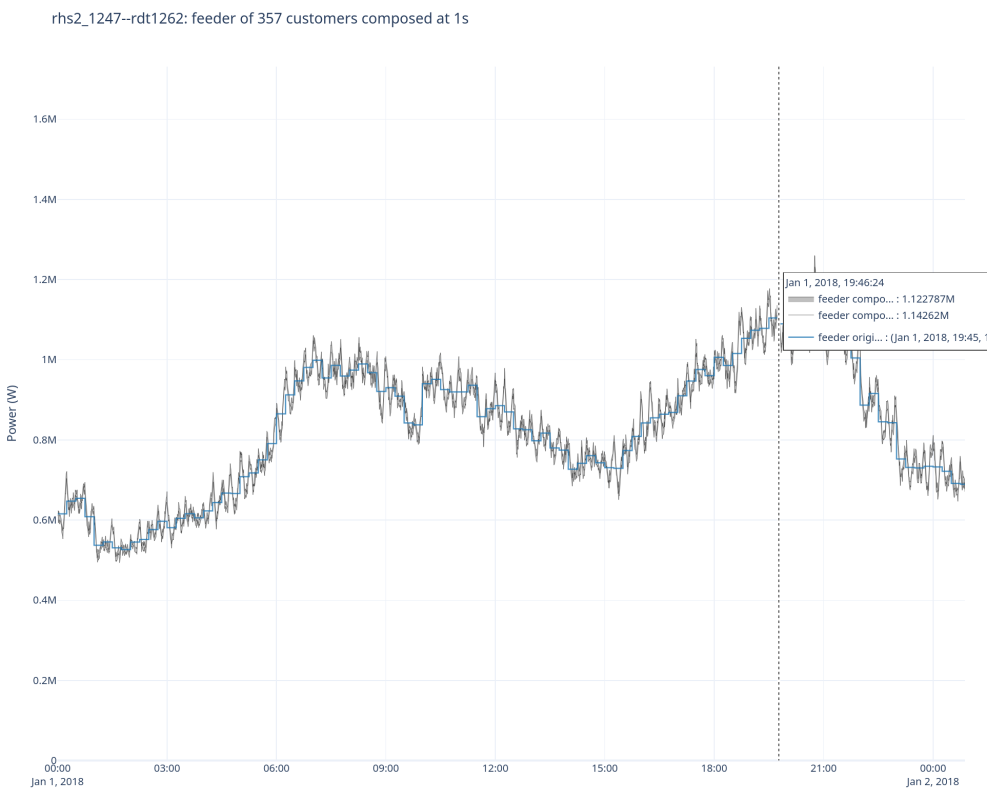
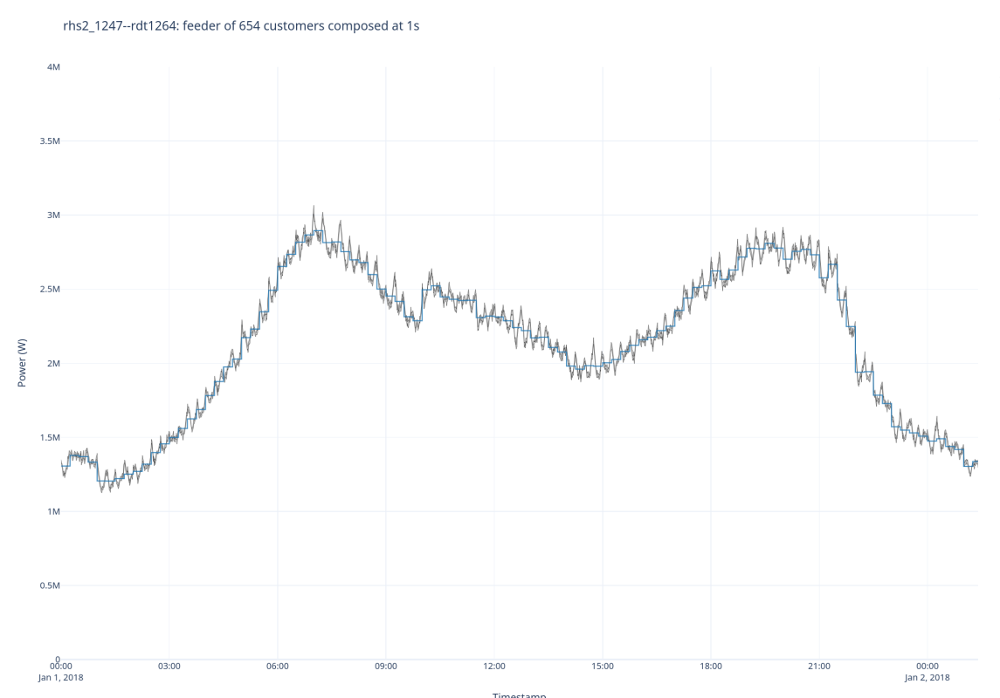

# MAGIC repository
## Introduction
- The MAGIC repository contains 2 packages: `omf` and `loadshape_upsampling`
  - The `omf` package is a nearly identical copy of the official `nreca-bts/omf` repository. It contains the new version of the `cyberInverters.py` model
    that uses `PyMAGIC` as the back-end instead of `PyCIGAR`. Various scenarios that use the new `cyberInverters.py` model are committed to
    `omf/omf/data/Model/admin/`. These scenarios are described in more detail below
  - The `loadshape_upsampling` package is designed to upsample lower-resolution load shapes (e.g. 15-minute resolution) into higher-resolution load shapes
    (e.g. 1-second resolution)
    - This package allows us to transform 15-minute load profiles from the SMART-DS dataset into 1-second load profiles so that our use cases and input
      configurations can be more detailed
- A third repository, `PyMAGIC`, must be copied into the base of the `MAGIC` repository. It is required to run the new `cyberInverters.py` model
  - This is a private repository and requires that the user has permissions to download the repository from its source
    - E.g. Run `git clone git@github.com:lbnl-cybersecurity/PyMAGIC.git` in the root of the MAGIC repository
    - The latest PyMAGIC commit that is confirmed to work with this repository is a904a6bb29d8c8fd9d1d2fef1e911ce716e3d050, dated 2026-08-11
      - E.g. Run `git clone git@github.com:lbnl-cybersecurity/PyMAGIC.git && git -C PyMAGIC checkout a904a6bb29d8c8fd9d1d2fef1e911ce716e3d050` in
        the root of the MAGIC repository to get a verified-working copy of PyMAGIC
## Usage
### Installation
- The installation script is designed to run on Ubuntu Linux. It was validated on 20.04 LTS and 26.04 LTS
- Run the following command to install the prerequisites that are required by the installation script
  ```
  sudo apt-get update && sudo DEBIAN_FRONTEND=noninteractive apt-get install -y python3 git openssh-client
  ```
- The `MAGIC` repository can be installed by running the `linux_install.py` installation script
  ```
  python3 linux_install.py
  ```
- The installation script performs the following actions:
  - It checks that the user has already git cloned the `PyMAGIC` repository into the root of the `MAGIC` repository. The script will error if the
    repository hasn't been downloaded
    - This can be done by running `git clone git@github.com:lbnl-cybersecurity/PyMAGIC.git` in the root of the `MAGIC` repository. The user must have the
      proper ssh configuration to perform this action. Alternatively, run `git clone https://github.com/lbnl-cybersecurity/PyMAGIC.git` to clone without
      ssh keys
  - It checks out the latest commit in `PyMAGIC` that is confirmed to work with the `cyberInverters.py` model
    - The commit is `a904a6bb29d8c8fd9d1d2fef1e911ce716e3d050`, dated 2026-08-11
  - It runs `utils/pymagic/patch.py` to patch the necessary files in `PyMAGIC` so that the omf can call `PyMAGIC`. This includes actions like copying
    `utils/pymagic/src/omf_observer_federate.py` into `PyMAGIC/src/pymagic/federates/omf_observer_federate.py`
  - It attempts to download the Rainforest Automation Energy (RAE) dataset that is required by the `loadshape_upsampling` package
    - This download usually doesn't work because Harvard Dataverse blocks scripted downloads. The user will probably need to go to
      `https://dataverse.harvard.edu/dataset.xhtml?persistentId=doi:10.7910/DVN/ZJW4LC` and download the ZIP file. Extract the ZIP file to `data/rae`
  - It attempts to download the SMART-DS dataset that is required by the `loadshape_upsampling` package
    - This download usually works and uses the aws CLI. If the download fails, the user should go to
      `https://data.openei.org/s3_viewer?bucket=oedi-data-lake&prefix=SMART-DS%2Fv1.0%2F&limit=50` and download the entire `2018` directory. That `2018`
      directory should be placed at `data/smartds/2018`
  - It creates three python virtual environments, one for `omf`, one for `PyMAGIC`, and one for `loadshape_upsampling`
    - Each virtual environment is located within its respective package
      - E.g. `omf/.venv`, `PyMAGIC/.venv`, and `loadshape_upsampling/.venv` are created. Each virtual environment must be activated before running code in
        the respective package
### Running the code
#### omf
- The `omf` package can be run by activating the virtual environment and starting the Flask web server
  - E.g. `. omf/.venv/bin/activate && cd omf/omf && python web.py`
- The web server is bound to port 5001, so go to `http://localhost:5001` to access the web server
#### loadshape_upsampling
- The `loadshape_upsampling` package can be run by activating the virtual environment and running `train.py` followed by `interpolate.py`
  - E.g. `. loadshape_upsampling/.venv/bin/activate && python loadshape_upsampling/src/train.py`
    - This script creates the library of shapelets that are used to upsample lower-resolution load shapes
  - E.g. `. loadshape_upsampling/.venv/bin/activate && python loadshape_upsampling/src/interpolate.py`
    - This script performs the actual upsample process on the designated load shape/feeder
    - Warning: this can crash your computer if you run out of disk space because this command can generate 100+ GB of files when upsampling entire feeders.
      The script aborts if it detects the user does not have enough filespace
- The upsampling process can also be quantitatively verified by running 
  `. loadshape_upsampling/.venv/bin/activate && python loadshape_upsampling/src/interpolate.py --validate`
- The default configuration for `interpolate.py` upsamples feeder `rhs2_1247--rdt1262` in the SMART-DS dataset
  - The output is written to `loadshape_upsampling/outputs`
  - The configuration can be adjusted by editing `loadshape_upsampling/config/config.yaml`
    - The most common yaml key that the user will probably want to change is `smartds_circuit`. This can be set to `rhs2_1247--rdt1262` or
      `rhs2_1247--rdt1264`
- It is also possible to interpolate individual loads or per-unit load profiles in the SMART-DS dataset
  - E.g. `interpolate.py --list` will show which loads will be interpolated if the script is run as-is
  - E.g. `interpolate.py --load load_p1rlv6095` will interpolate just that physical load
  - E.g. `interpolate.py --per-unit --load com_kw_14989_pu` will interpolate just that per-unit load shape
- Compressed copies of the full-feeder upsampled CSVs and their accompanying .html visualization files are committed to the outputs directory
#### PyMAGIC
- The `PyMAGIC` repository is only intended to be used as the back-end for `cyberInverters.py`. Please read the documentation inside of the `PyMAGIC`
  repository for instructions on how to use it directly
## Package descriptions
### `omf`
- The `omf` package is a copy of the `nreca-bts/omf` repository that applies the following changes:
  - `cyberInverters.py` and `cyberInverters.html` have been rewritten to use the `PyMAGIC` backend instead of the `PyCIGAR` backend
  - `omf/omf/web.py` is modified to accept large form submissions via the Flask web server with these lines:
    ```
    app.config['MAX_FORM_MEMORY_SIZE'] = None	# was 500KB default in Werkzeug 3.1+
    app.config['MAX_CONTENT_LENGTH']  = None	# optional: also uncap total body
    app.config['MAX_FORM_PARTS']      = None	# optional: uncap field count
    ```
    - Werkzeug used to accept forms of unlimited size, but newer versions of Werkzeug cap the limit at 500 KB. If the user has installed a version of
      Werkzeug > 3.1 in their environment, these lines are necessary to prevent 413 errors when `cyberInverters.html` is submitted to the web server
  - `omf/pyproject.toml` is modified to include the `PyYAML` package because user input from `cyberInverters.html` is used to update the `PyMAGIC` input
    files for a given model run
- `omf/omf/static/testFiles/pyMAGIC` contains 4 input configurations for the new `cyberInverters.py` model
  1) ieee37 no attack
  2) ieee37 staggered voltage imbalance attack
  3) ieee123 no attack
  4) ieee123 staggered voltage imbalance attack
- These input configurations are described in more detail below
#### cyberInverters.py scenario descriptions
- The desired scenario for `cyberInverters.py` can be chosen by editing lines 40 - 43 in `cyberInverters.py`
  ```
  def new(model_dir):
    '''Create a new instance of this model. Returns true on success, false on failure.'''
    topology = 'ieee37'
    #topology = 'ieee37_attack'
    #topology = 'ieee123'
    #topology = 'ieee123_attack'
  ```
- Set the `topology` variable to point to the desired input configuration inside of `MAGIC/omf/omf/static/testFiles/pyMAGIC`
##### ieee37 no attack
- 
- A regular power flow simulation is performed on the ieee37 delta feeder. There are PV inverters but no batteries. This scenario establishes the normal
  voltage behavior
##### ieee37 staggered voltage imbalance attack
- 
- The ieee37 feeder is subject to a voltage imbalance attack. 60% of each PV inverter's VVVW breakpoints are shifted +0.05 p.u. upward to raise voltage,
  staggered by phase pair 
  - ab over t=1000-1133 s
  - bc over 1134-1267 s
  - ac over 1268-1400 s
- Only one phase pair rises at a time and the feeder becomes unbalanced. There is no adaptive controller defense or algorithmic defense
##### ieee123 no attack
- 
- A regular power flow simulation is performed on the ieee123 wye feeder. There are PV inverters and batteries. This scenario establishes the normal
  voltage behavior
##### ieee123 staggered voltage imbalance attack
- 
- The ieee123 feeder is subject to a voltage imbalance attack. 60% of each PV inverter's VVVW breakpoints are shifted +0.05 p.u. upward to raise voltage,
  staggered by phase
  - a over t=1000-1133 s
  - b over 1134-1267 s
  - c over 1268-1400 s
- Only one phase rises at a time and the feeder becomes unbalanced. There is no adaptive controller defense or algorithmic defense
### `PyMAGIC`
- 
- The `PyMAGIC` repository is required to run the new `cyberInverters.py` model
- Once the PyMAGIC repository has been downloaded and placed in the root of the `MAGIC repository`, the omf integration must be installed into it
  - `omf_observer_federate.py`  is copied into place, and the `patch_*.py` scripts in `utils/pymagic/src` apply the integration's small edits to
    `PyMAGIC`'s own files in place. `PyMAGIC` is private, so this repository stores only the edits, never modified copies of `PyMAGIC` files
- The script `utils/pymagic/patch.py` performs the copy and runs every patch script. The patch scripts exit with an error if `PyMAGIC` has drifted from
  the pinned commit such that an edit no longer applies cleanly
  - The `linux_install.py` script will run this script at install time. If the install script runs before the `PyMAGIC` repository has been downloaded, the
    script will exit with an error and tell the user to download the `PyMAGIC` repository
### `loadshape_upsampling`
- 
- 
- The `loadshape_upsampling` package is designed to upsample lower-resolution (e.g. 15-minute) load shapes into higher resolution (e.g. 1-second) load
  shapes while preserving the mean power consumption of the original load shape
- The package is valuable because it allows the user to upsample SMART-DS load profiles into 1-second resolution in order to create more detailed scenarios
- The upsampling process works as follows:
  - The user passes in a lower-resolution (e.g. 15-minute) load shape
  - The lower-resolution load shape is split into intervals of a given size according to the user's configuration
    - The default interval length is 15 minutes
  - The mean power consumption of each interval is calculated
  - Appliance power consumption patterns are drawn from a library of 1-second shapelets sampled from the Rainforest Automation Energy (RAE) dataset and are
    placed randomly across the intervals
  - Once enough events have been placed such that the sum of the power of the events is within a threshold of the mean power of a given interval, that
    interval is considered complete and no more events are placed within that interval
  - The remaining power in the interval is filled in with a smooth base layer that makes the upsampled interval match the mean of the original interval
    exactly
  - The upsampling process is finished when the mean of every composed interval equals its original interval's mean
  - The higher-resolution load shape has higher volatility and granularity than the input load shape while still preserving the power consumption of the
    original lower-resolution load shape
## Next steps
- As of 2026-08-17, next steps for the project include selecting a use case (e.g. peak shaving) that will demonstrate the value of cyberInverters.py and
  PyMAGIC to real-world users, such as coops
- Once a use case has been selected, an input configuration (i.e. a set of files in `testFiles/pyMAGIC`) must be defined to represent that use case
  - PyMAGIC must support the use case (e.g. PyMAGIC doesn't currently have centralized battery charging and discharging so the peak shaving use case cannot
    be performed at this time)
- Once the base input configuration has been created, a cyberattack should be designed on top of that use case
  - This is fairly simple and is done with sim.yaml for a given input configuration
- The cyberattack should be combined with a mitigation defense agent from LBNL. We need to describe our use case to LBNL and provide them with the base
  input configuration so that they can run it, stage the attack, and properly train a defense agent for it to provide attack mitigation
- Once complete, the results of running the use case, the cyberattack, and the defense mitigation should be documented
## References
- https://data.openei.org/submissions/2981
- https://dataverse.harvard.edu/dataset.xhtml?persistentId=doi:10.7910/DVN/ZJW4LC
- https://github.com/nreca-bts/omf
- https://github.com/lbnl-cybersecurity/PyMAGIC
## BSD 3-Clause License

Copyright (c) 2025, NRECA Research

#### Redistribution and use in source and binary forms, with or without modification, are permitted provided that the following conditions are met:

1. Redistributions of source code must retain the above copyright notice, this
list of conditions and the following disclaimer.

2. Redistributions in binary form must reproduce the above copyright notice,
this list of conditions and the following disclaimer in the documentation
and/or other materials provided with the distribution.

3. Neither the name of the copyright holder nor the names of its
contributors may be used to endorse or promote products derived from
this software without specific prior written permission.
 

THIS SOFTWARE IS PROVIDED BY THE COPYRIGHT HOLDERS AND CONTRIBUTORS "AS IS"

AND ANY EXPRESS OR IMPLIED WARRANTIES, INCLUDING, BUT NOT LIMITED TO, THE

IMPLIED WARRANTIES OF MERCHANTABILITY AND FITNESS FOR A PARTICULAR PURPOSE ARE

DISCLAIMED. IN NO EVENT SHALL THE COPYRIGHT HOLDER OR CONTRIBUTORS BE LIABLE

FOR ANY DIRECT, INDIRECT, INCIDENTAL, SPECIAL, EXEMPLARY, OR CONSEQUENTIAL

DAMAGES (INCLUDING, BUT NOT LIMITED TO, PROCUREMENT OF SUBSTITUTE GOODS OR

SERVICES; LOSS OF USE, DATA, OR PROFITS; OR BUSINESS INTERRUPTION) HOWEVER

CAUSED AND ON ANY THEORY OF LIABILITY, WHETHER IN CONTRACT, STRICT LIABILITY,

OR TORT (INCLUDING NEGLIGENCE OR OTHERWISE) ARISING IN ANY WAY OUT OF THE USE

OF THIS SOFTWARE, EVEN IF ADVISED OF THE POSSIBILITY OF SUCH DAMAGE.